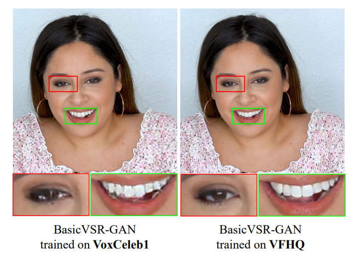
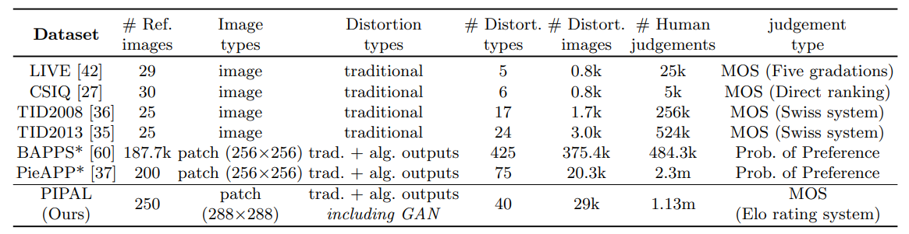

  
  

    <b>XPixel Homepage</b>
    
      <a href="http://xpixel.group/">
        <i>HOT</i>
      </a>
    
  

  
&nbsp;

<!-- English | [简体中文](README_zh-CN.md) -->

# Introduction

**X-Evaluation-and-Benchmark** is dedicated to presenting the benchmarks for low-level computer vision released by XPixel. In the field of image restoration, benchmarks play a significant role in evaluating and comparing the performance of various algorithms. Image restoration benchmarks consist of standardized datasets and evaluation metrics that provide a common ground for researchers to assess the effectiveness of their methods. 

# Full list

- [VFHQ: A High-Quality Dataset and Benchmark for Video Face Super-Resolution](#vfhq)
- [PIPAL: a Large-Scale Image Quality Assessment Dataset for Perceptual Image Restoration](#pipal)
- [A Framework for Systematic Evaluation of Real-World Super-Resolution](#realsr_se)

# Papers

## VFHQ: A High-Quality Dataset and Benchmark for Video Face Super-Resolution

Most of the existing video face super-resolution (VFSR) methods are trained and evaluated on VoxCeleb1, which is designed specifically for speaker identification and the frames in this dataset are of low quality. In this paper, we collect a high-quality video face dataset (VFHQ), which contains over 16,000 high-fidelity clips of diverse interview scenarios. To verify the necessity of VFHQ, we further conduct experiments and demonstrate that:
1. VFSR models trained on our VFHQ dataset can generate results better than those trained on VoxCeleb1.
2. The temporal information plays a pivotal role in eliminating video consistency issues as well as further improving visual performance.

  

- **Authors**: Liangbin Xie. Xintao Wang, Honglun Zhang, Chao Dong, Ying Shan
- Accepted at CVPRW'22
- **Links**: :scroll:[`paper`](https://arxiv.org/abs/2205.03409) :house:[`project`](https://liangbinxie.github.io/projects/vfhq)

## PIPAL: a Large-Scale Image Quality Assessment Dataset for Perceptual Image Restoration

The most recent image restoration (IR) methods based on Generative Adversarial Networks (GANs) have achieved significant improvement in visual performance. However, we observe an increasing inconsistency between perceptual quality and the evaluation results. Then we raise two questions:
1. Can existing IQA methods objectively evaluate recent IR algorithms?
2. When focus on beating current benchmarks, are we getting better IR algorithms?

To answer these questions and promote the development of IQA methods, we contribute a large-scale IQA dataset, called Perceptual Image Processing Algorithms (PIPAL) dataset. Especially, this dataset includes the results of GAN-based methods, which are missing in previous datasets. We collect more than 1.13 million human judgments to assign subjective scores for PIPAL images using the more reliable "Elo system". Based on PIPAL, we present new benchmarks for both IQA and super-resolution methods. Our results indicate that:
1. Existing IQA methods cannot fairly evaluate GAN-based IR algorithms.
2. IQA methods should be updated along with the development of IR algorithms.

  

- **Authors**: Jinjin Gu, Haoming Cai, Haoyu Chen, Xiaoxing Ye, Jimmy S. Ren, Chao Dong
- Accepted at ECCV'20
- **Links**: :scroll:[`paper`](https://arxiv.org/abs/2007.12142)

## A Framework for Systematic Evaluation of Real-World Super-Resolution

- **Authors**: Wenlong zhang, Xiaohui Li, Xiangyu Chen, Xiaoming Wu, Chao Dong
- **Links**: :scroll:[`paper`](TODO)

# License

This project is released under the [Apache 2.0 license](LICENSE).

# Projects in Open-XSource

- [X-Super Resolution](https://github.com/XPixelGroup/X-Super-Resolution): Algorithms in the realm of image super-resolution.
- [X-Image Processing](https://github.com/XPixelGroup/X-Image-Processing): Algorithms in the realm of image restoration and enhancement.
- [X-Video Processing](https://github.com/XPixelGroup/X-Video-Processing): Algorithms for processing videos.
- [X-Low level Interpretation](https://github.com/XPixelGroup/X-Low-level-Interpretation): Algorithms for interpreting the principle of neural networks in low-level vision field.
- [X-Evaluation and Benchmark](https://github.com/XPixelGroup/X-Evaluation-and-Benchmark): Datasets for training or evaluating state-of-the-art algorithms.
